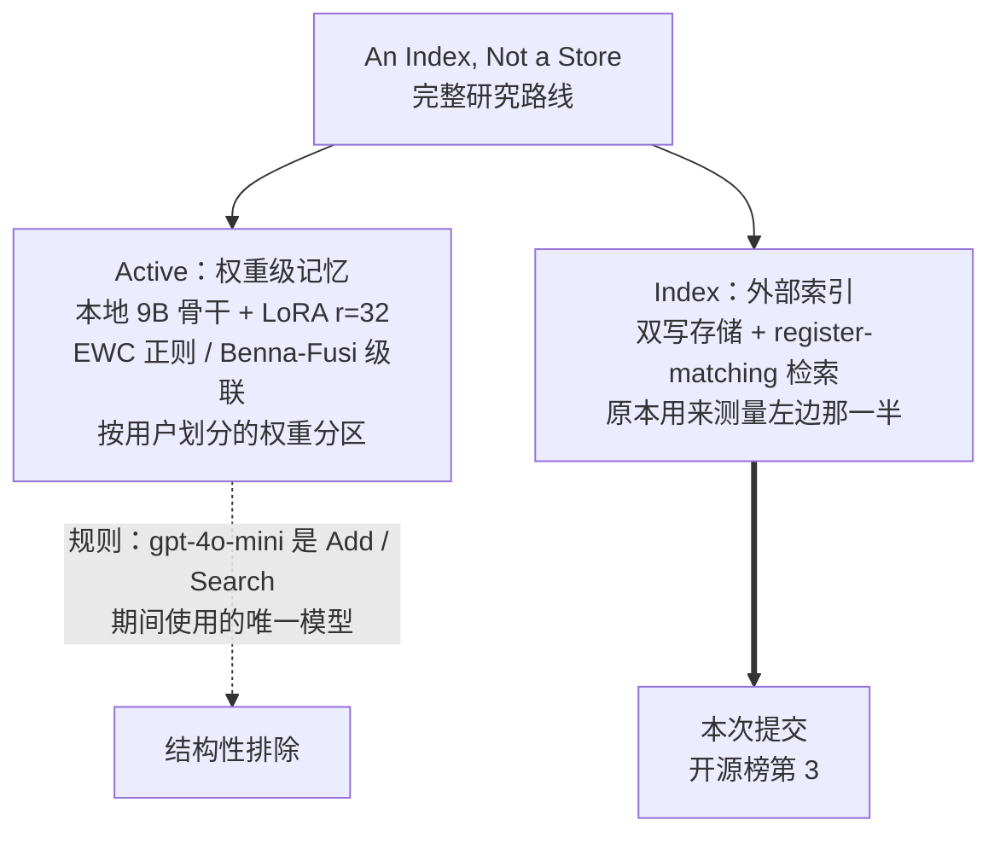
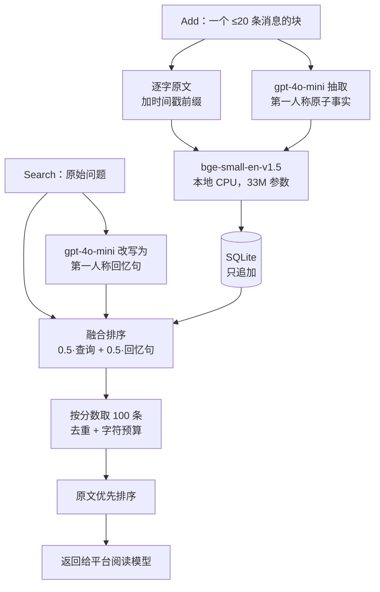

# ActiveMemoryIndex：一个不做记忆治理的系统，为什么治理分排第一

**Agent Memory Leaderboard 首期开源榜第 3 名 · 独立研究者提交**

AML 在邀请函里提到，我们在"新值覆盖与当前状态判定"（54.50）和"矛盾检测与冲突消解"（24.79）两个细项上位列全榜第一。

这里需要先说清一件事：**ActiveMemoryIndex 的存储层只有 `CREATE` 和 `INSERT OR REPLACE` 两种 SQL 动作，没有一条 `UPDATE`，没有一条 `DELETE`。** 系统从不更新记忆、不合并、不让旧记忆失效、不检测矛盾、不做冲突消解。写进去的每一条永远有效，彼此完全平权。

所以那两个第一，是在**没有任何治理机制**的情况下拿到的。

这不是谦虚，是这篇文章的起点。我们手上有一个可以公开的旁证：本期榜单上确实有系统实现了治理——FlowGrid 会标注冲突、给旧值降权但不删除，它在自己的 README 里测出陈旧值泄漏率 0.53，而它的记忆治理轴得分 **27.86，是学术榜前十里最低的**；我们完全不做治理，得 **37.95，最高**。

如果这不是巧合，它说的是：**治理的价值在于真正改变"返回什么"，而不是改变分数排序。** 标注和降权把判断责任留在中间层，却没有能力承担——旧值仍然进入上下文，只是排得靠后一点，阅读模型照样读到。而把完整、带时间戳、未经改写的原始记录交给阅读模型，让它自己判断哪条还有效，反而更稳。

这是一个假设，不是结论。但它解释了这个系统为什么长成现在这样。

---

## 一、名字的由来：Active 那一半没能参赛

ActiveMemoryIndex 的名字来自底层研究 *An Index, Not a Store: The Model Does Remember — It Just Needs Its Notebook*，两个词对应研究的两半。

**Active 指的是写进权重的记忆。** 论文的主体是在线权重级学习——用 LoRA 适配器把新知识直接写进一个本地 9B 模型的权重，让**模型本身成为存储**，检索是从权重里唤起回忆。这才是"主动记忆"的原意：记忆不是躺在外部索引里等人来查，而是变成模型的一部分。

**Index 指的是外部索引。** 双写存储加 register-matching 检索，这套 Add/Search harness 当初是为了在 InMind 基准上**测量**那个权重级系统而造的对照工具。

赛事规则要求 `gpt-4o-mini` 是 Add 和 Search 期间使用的唯一模型。于是论文里最强的配置（9B 骨干 + LoRA r=32）、EWC 正则、Benna-Fusi 级联、按用户划分的权重分区，全部被排除在提交之外——不是我们放弃了，是这个契约在结构上容纳不了权重级记忆。



**我们拿去参赛的，是当初用来做测量的仪器，不是被测量的东西。**

这一点也值得 AML 知道：当前契约把"模型即存储"这一整类架构排除在外了，榜单目前测量的是外部索引这一族。固定生成模型才能公平比较记忆系统，这是对的；只是它同时划定了覆盖面。

---

## 二、系统设计



**写入：双写。** 每个 Add 请求的消息存两份。一份是逐字原文，前面加 `[YYYY-MM-DD HH:MM]` 时间戳、按 role 标注说话人；另一份是 gpt-4o-mini 从整块里抽出的第一人称原子事实。两份用同一个本地嵌入模型编码，写进同一张 SQLite 表，**在返回 200 之前完成提交**——契约要求写入后立即可检索。

**检索：把问题改写成用户自己的口吻。** 语料是第一人称聊天记录，而问题是第三人称提问（"John 打算做什么"），两者不在同一个语域。我们让 gpt-4o-mini 把问题改写成用户回忆自己的句子（"我说过 John 的打算吗"），再把它的嵌入和原查询的嵌入融合起来排序。

需要明确说明：**这就是 HyDE**（Gao, Ma, Lin, Callan, 2022, arXiv:2212.10496）N=1 的情况。因为 `(1-w)·(q·d) + w·(r·d) = ((1-w)q + w·r)·d`，加权相似度和嵌入平均是同一个操作，w=0.5 正是论文里的默认形式。我们独有的只是那个 prompt——生成回忆**问句**而非假想**答案**。

**返回：原文优先。** 选出的 100 条按"逐字原文在前、抽取事实在后"排列，各自内部保持相关度顺序。这一步只改顺序、不改集合。

**没有的东西：** 图、层级摘要、实体消歧、记忆治理。

### 各部件实测值多少

LoCoMo 全部 10 段对话，n=1540，平台的 answer 与 judge prompt，gpt-4o-mini 阅读，每臂 2–3 次独立重复：

| 配置 | 准确率 | 相对相关度序 |
|---|---|---|
| 只用抽取事实 | .513 | −7.6 |
| 相关度序（基线） | .5887 | — |
| 只用逐字原文 | .624 | +3.5 |
| **原文优先排序（提交版本）** | **.6333** | **+4.5** |

配对检验：原文优先 vs 相关度序，+141/−67，p < 0.0001，四个类别全部提升。

三个我们自己造了又拿掉的部件：

| 部件 | 实测 | 结局 |
|---|---|---|
| BM25 + RRF 混合通道 | +1.8 分 | **删除**——把 BM25 限制在原文通道得 .6390，而纯粹把原文排前面得 .6333，落在前者重复实验的离散区间内。整套 FTS5 换来的东西，一个 `ORDER BY` 就有 |
| agentic 反思 + 第二轮检索 | 端到端 0 | **默认关闭**——检索 recall@10 从 .711 升到 .741，端到端准确率不动，而它每次搜索多花一次 LLM 调用 |
| 父块整块返回 | +7.8 分 | **不采用**——见下 |

**关于父块那 7.8 分。** 把命中项所在的整块 20 条消息一起返回得 .711。但一个等预算对照让它出局：把父块砍到和基线相同的字符数，它只有 .572，比基线**低 6.1 分**。粗粒度单元本身是负贡献，全部收益来自 5.4 倍的内容量——而内容量能涨，是因为契约的 `top_k` 只限**条数**不限**大小**。

我们还发现在这个契约下体积和粒度不可分离：100 条上限下，用单条消息最多凑到约 12.4k 字符；想返回更多文本，就必须把"一条记忆"定义得更粗。这条路的极限是合法的退化解——一段 LoCoMo 对话约 40 块，全返回就是逐字交出整段对话，条数 40 ≤ 100。

所以 .711 测量的不是记忆能力，是我们被允许花掉多少阅读器上下文。**这里有一个给 AML 的具体建议：在条数上限之外增加 token 上限，或在榜单上把 tokens/query 与准确率并列公布。** 先例是 TREC QA 把答案串从 250 字节收紧到 50 字节，理由完全相同——每一个同时提交两种长度的机构都是 250 字节得分更高。

### 成本

整轮 full 评测的 LLM 成本约 **$0.23**（2,385 次 gpt-4o-mini 调用）。嵌入模型是 33M 参数的 bge-small，跑在 CPU 上，没有 GPU。存储是一个 SQLite 文件。服务空载常驻内存约 330 MB。

---

## 三、一个完整的例子

以下是真实运行的输出，不是示意。

**输入** —— 平台发来的一个 Add 请求（LoCoMo conv-2，节选 6 条消息）：

```
assistant  Hey John! Long time no see! What's up?
user       Hey Maria! Good to see you. Just got back from a family road trip yesterday...
assistant  Been busy volunteering at the homeless shelter and keeping fit. Just started
           doing aerial yoga, it's great. Have you tried any other cool workout classes?
user       Woah, Maria, that sounds cool! I'm doing kickboxing and it's giving me so much energy.
assistant  Cool, John. Kickboxing is a perfect way to stay in shape and de-stress...
user       Yeah Maria, I'm really hoping to get into local politics...
```

**存储 A —— 逐字原文**（`kind=raw`，6 条）：

```
[2023-05-08 13:56] Assistant: Hey John! Long time no see! What's up?
[2023-05-08 13:57] I: Hey Maria! Good to see you. Just got back from a family road trip...
[2023-05-08 13:58] Assistant: Been busy volunteering at the homeless shelter and keeping
                   fit. Just started doing aerial yoga, it's great...
[2023-05-08 13:59] I: Woah, Maria, that sounds cool! I'm doing kickboxing...
[2023-05-08 14:00] Assistant: Cool, John. Kickboxing is a perfect way to stay in shape...
[2023-05-08 14:01] I: Yeah Maria, I'm really hoping to get into local politics...
```

**存储 B —— gpt-4o-mini 抽取的原子事实**（`kind=fact`，6 条）：

```
[2023-05-08 13:56] Maria greeted John and said, 'Hey John! Long time no see! What's up?'
[2023-05-08 13:58] Maria said she has been busy volunteering at the homeless shelter and
                   keeping fit. Maria just started doing aerial yoga and thinks it's great.
[2023-05-08 13:59] John said he is doing kickboxing and it's giving him so much energy.
[2023-05-08 14:01] John said he is really hoping to get into local politics because he
                   loves helping the community and making it a better place.
```

值得注意：抽取出来的事实和原文高度重叠，很多只是把第一人称转成第三人称的转述。**这正是后面那些消融结果的来源——抽取是有损的改写，它的净贡献只有 0.9 分，而代价是每次写入一次 LLM 调用。**

**检索** —— 平台发来问题：

```
QUERY:  What exercise class did Maria start?

gpt-4o-mini 改写为第一人称回忆句：
        What did I say about the exercise class Maria started?

返回（top 6，原文优先）：
  1. [raw ] [13:58] Assistant: Been busy volunteering at the homeless shelter and keeping
                    fit. Just started doing aerial yoga, it's great...        ← 答案在这里
  2. [raw ] [13:59] I: Woah, Maria, that sounds cool! I'm doing kickboxing...
  3. [raw ] [14:01] I: Yeah Maria, I'm really hoping to get into local politics...
  4. [fact] [13:58] Maria said she has been busy volunteering at the homeless shelter and
                    keeping fit. Maria just started doing aerial yoga and thinks it's great.
  5. [fact] [14:00] Maria said kickboxing is a perfect way to stay in shape and de-stress...
  6. [fact] [13:56] Maria greeted John and said, 'Hey John! Long time no see!'
```

第 1 条和第 4 条内容等价——一条是原话，一条是转述。我们把原话放在前面，因为阅读模型最先读到的位置最重要，而原话没有经过第二次有损编码。

---

## 四、下一步

**已经完成、等下一期 full 评测验证的：邻居窗口。**

每条命中的原文连同它前后各一条一起返回。邻居占用同一批 100 个名额，所以这是在固定预算内换一种花法，不是多塞内容——来源块从 26.2 降到 20.9，字符只多 8%。

实测 **.6333 → .6802，+4.7 分**（n=1540，配对 +141/−67，p < 0.0001），其中时序类提升 5.3 分。半径 1、2、3 之间统计上无法区分，我们取 1，因为它每个种子只占 3 个名额、保留最多广度。

同一个例子，开窗之后：

```
QUERY:  What exercise class did Maria start?
  1. [raw ] [13:58] ...Just started doing aerial yoga...     ← 命中
  2. [raw ] [13:57] I: Hey Maria! Good to see you...          ← 前一条，补上"是谁在问"
  3. [raw ] [13:59] I: Woah, Maria, that sounds cool!...      ← 后一条，补上"John 的回应"
  ...
```

单独一条消息常常不自足：代词的指代、对方的那一句、会话的日期，都在相邻轮次里，而阅读模型无法还原从未发给它的东西。

**这一条要谢 InvMem。** 我们是读了本期第一名公开仓库里那行 `MEMORY_RESULT_WINDOW=1`，才回头发现自己错误地否掉了一整族技术——我们从"父块在等预算下更差"推出"广度是硬约束"，然后用它排除了所有扩展返回单元的做法。正确的说法是：广度在极端处有约束，在中间区间没有。相邻上下文在这张榜上并不罕见，第 10 名 aml-memory-mvp 有 adjacent-turn expansion，第 8 名 FlowGrid 给相邻证据加分。**这不是我们贡献给社区的技术，是我们缺、而好几个同行都有的技术。**

如果这是一张只公布分数的闭源榜，我们至今不会知道自己漏了什么。

**接下来真正要攻的是时序。**

C 轴（时间与事件序列）是我们最弱的一项，18.35。而整个开源榜集体困在 18–24.6，工业榜前两名是 56–60。这不是我们一家的问题，是这一类方法的共同边界。

我们读过的公开参赛系统处理时间的方式是：把时间戳当前缀贴在文本上、正则抓年份、或者按**插入时间**做指数衰减。这些都不是时序推理。我们计划做的是**写入时把相对时间表达解析成绝对时间，并给事实加版本**——"上周"在写入时就该被锚定成具体日期，而同一状态的新旧值之间应该有先后关系。它同时打 C 和 A（时间锚定错了，事实召回也跟着错），而且它在写入层，正是我们从来没碰过、整个开源榜也集体空白的那一层。

有意思的是，这会把我们推向 AML 邮件里最初描述的那条路线。区别在于，那句描述**现在**还不准确；如果将来准确了，是因为我们真的去建了它。

**另外两件在评估中的事：**

一是**抽取通道要不要留**。它只值 0.9 分，却是每次写入的固定成本。如果一个更轻的写入路径能拿到同样的分，那就该换掉。

二是**权重级那一半继续做**。它不能进这张榜，但它是这条研究路线的主体。

---

## 五、团队

ActiveMemoryIndex 由 **Xuhao Lin（林栩皓）** 提交，独立研究者，非公司、非机构。

实际的工作方式是一人加一个 AI 协作者（Claude）：代码、实验设计与本文初稿在协作中产生，全部实验在自有硬件上执行、由作者核验，所有取舍——上线什么、放弃什么、哪些分数不要——由作者判断。

这个分工不是形式上的。本文记录的错误里有两处是 AI 协作者犯的：把一个在极端点上成立的结论外推到中间区间（因此漏掉了邻居窗口），以及在给子智能体的指令里喂进偏差（导致对同一批数据 51% 与 24% 两个互相矛盾的噪声估计）。而促成最大一处改进的观察——去读第一名仓库里那行配置——来自作者。

一份声称"由 AI 协作完成"的技术报告，如果不说明协作在哪里出错、又在哪里被人纠正，那份声明就没有信息量。

---

## 链接

- **代码：** [github.com/linxuhao/ActiveMemoryIndex](https://github.com/linxuhao/ActiveMemoryIndex) （MIT）
- **底层研究：** *An Index, Not a Store: The Model Does Remember — It Just Needs Its Notebook*，[doi:10.5281/zenodo.21405963](https://doi.org/10.5281/zenodo.21405963)
- **小红书：** 林栩皓（ID 27744870334）
- **X：** [@xhlink](https://x.com/xhlink)

引用与致谢：HyDE（arXiv:2212.10496）、query2doc（arXiv:2303.07678）、passage-level evidence（Callan, SIGIR 1994）、LoCoMo（arXiv:2402.17753）、AML 公开评测代码，以及本期开源榜上所有公开了代码的同行。

**口径：** 榜单分数（44.84，开源榜第 3）对应提交时的版本，不含邻居窗口——那是榜单公布后补上的，要到下一期 full 评测才会反映到榜上。文中其余数字来自我们自己的离线复现（公开 locomo10 数据、本地裁判、n=1540、每臂 2–3 次重复），与 AML 评测是两把不同的尺子，应作为**配置之间的排序**参考，不与榜单分数直接换算。全部实验数据在仓库 `bench/results/`，每个数字都可以用仓库里的命令重跑。
